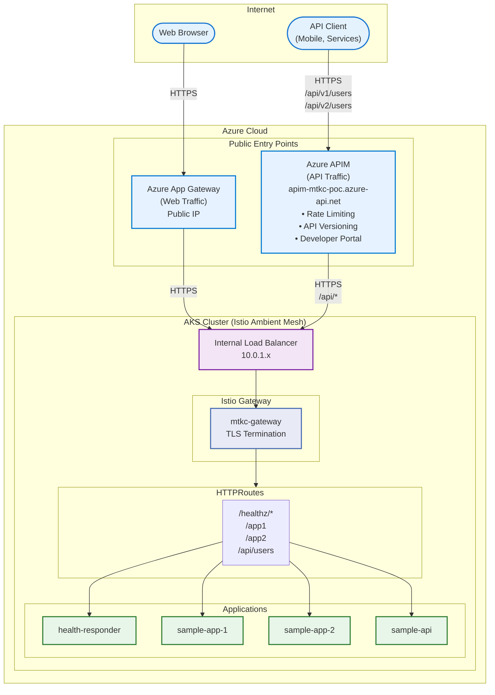
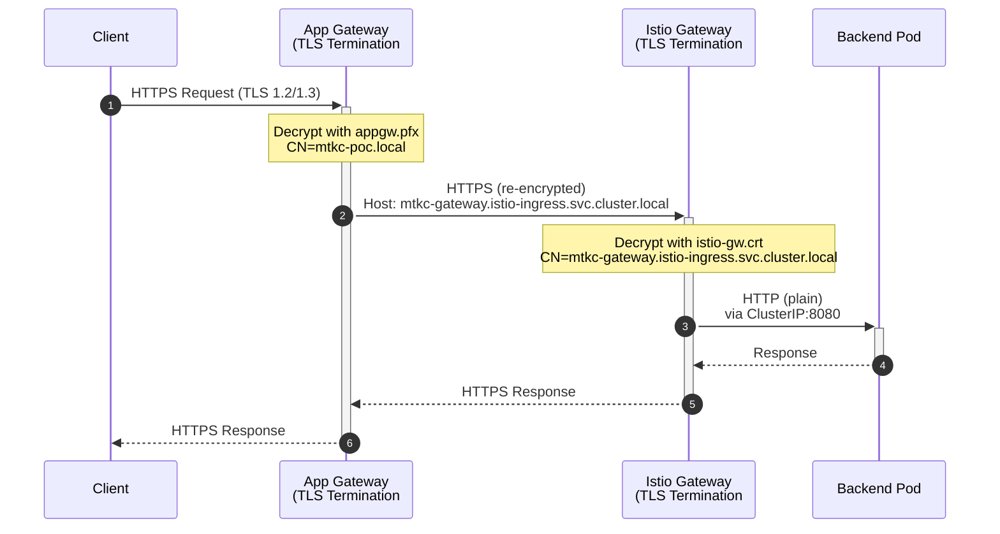
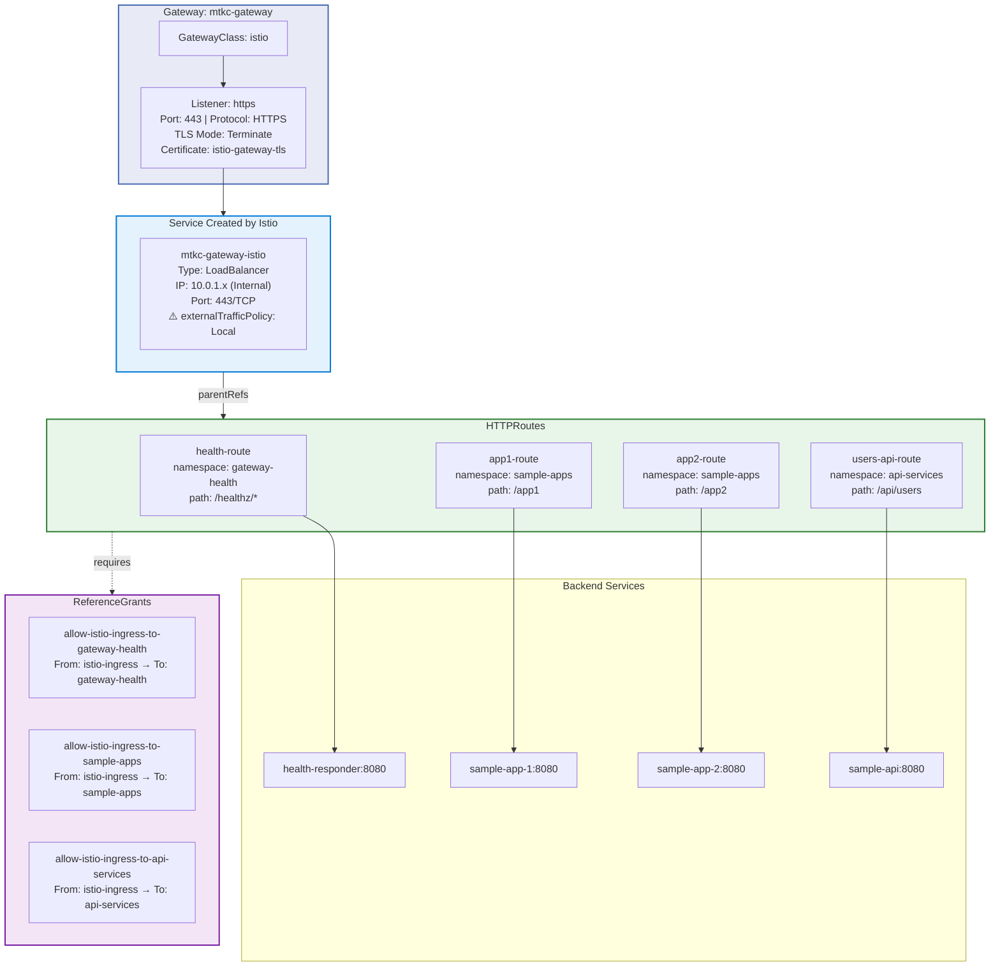
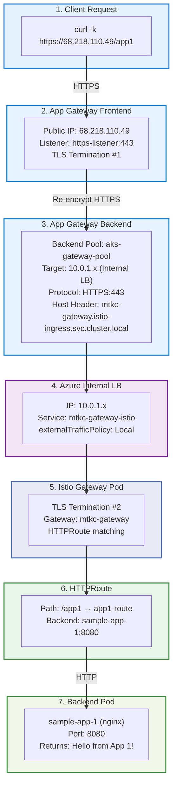
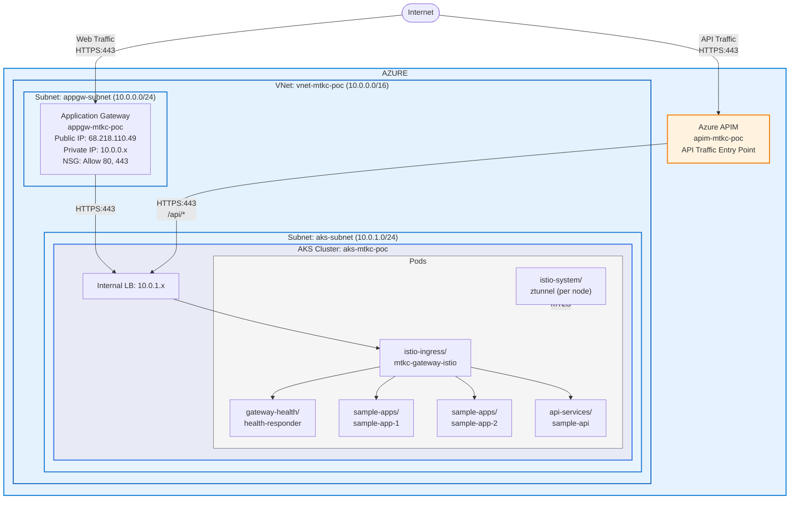
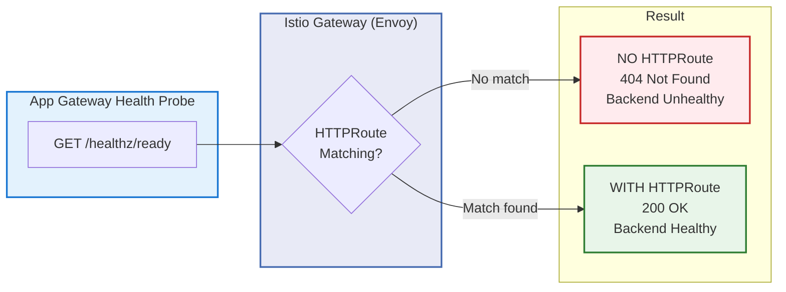
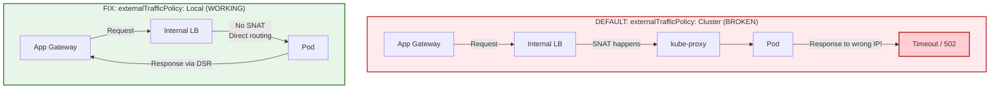
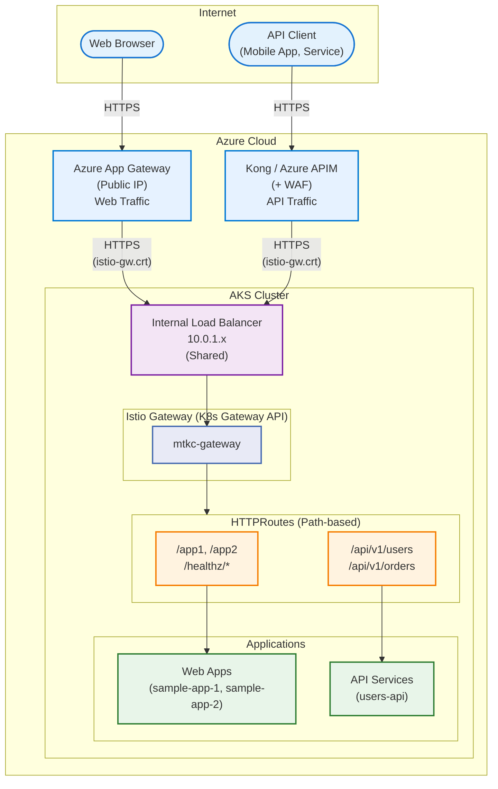
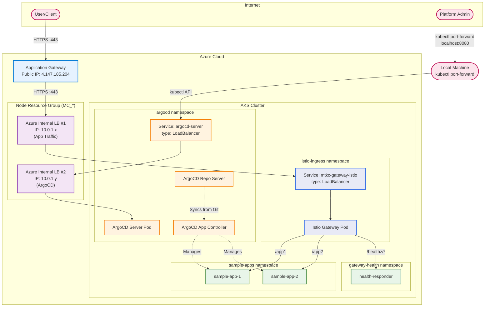

# AKS POC - Azure Application Gateway Integration with Kubernetes Gateway API for Multitenancy

This POC validates Azure Application Gateway integration with Kubernetes Gateway API on AKS with Istio Ambient Mesh.

Kubernetes Gateway API provides a superior approach to multi-tenancy compared to legacy Ingress controllers. With Gateway API, a single shared Gateway serves as the centralized entry point, while individual HTTPRoutes in each tenant's namespace define their own routing rules. This eliminates the need to deploy separate Ingress controllers per tenant, reducing infrastructure overhead, simplifying operations, and enabling consistent traffic policies across all tenants through a unified control plane.

## Key Technologies

- **Kubernetes Gateway API** (NOT classic Ingress)
- **Istio Ambient Mesh** (NOT sidecar mode)
- **Azure Application Gateway v2** (Web Traffic)
- **Azure API Management** (API Traffic)
- **ArgoCD** with **Sync Waves** (GitOps for all K8s resources)
- **Azure Service Operator (ASO)** (Manages APIM APIs via K8s CRDs)
- **Terraform** for Azure infrastructure only
- **End-to-End TLS** with self-signed certificates

## GitOps Architecture

Everything on AKS is managed via ArgoCD with Sync Waves for proper dependency ordering:

```
┌─────────────────────────────────────────────────────────────────────────────┐
│                       TERRAFORM (Infrastructure Only)                        │
│  - AKS Cluster, VNet, Subnets, NSGs                                         │
│  - Azure Application Gateway                                                 │
│  - Azure API Management (instance only, not API configs)                    │
│  - ArgoCD bootstrap                                                          │
└─────────────────────────────────────────────────────────────────────────────┘
                                    │
                                    ▼
┌─────────────────────────────────────────────────────────────────────────────┐
│                          ARGOCD (GitOps)                                     │
│                                                                              │
│  Sync Wave Order:                                                            │
│    Wave -1: Istio Base (CRDs)                                               │
│    Wave  0: Istiod + Istio CNI + Ztunnel (Ambient Mesh)                     │
│    Wave  1: Namespaces (with istio.io/dataplane-mode: ambient)              │
│    Wave  2: cert-manager                                                     │
│    Wave  3: Azure Service Operator (ASO)                                    │
│    Wave  5: Gateway + LoadBalancer Service                                  │
│    Wave  6: ReferenceGrants + HTTPRoutes                                    │
│    Wave  7: Applications (Web Apps, APIs)                                   │
│    Wave  9: APIM API Configuration (via ASO CRDs)                           │
│                                                                              │
└─────────────────────────────────────────────────────────────────────────────┘
```

## POC Success Criteria

### Web Traffic (App Gateway)

| ID | Criteria | Validation |
|----|----------|------------|
| SC-1 | App Gateway health probes succeed | Backend Health = "Healthy" |
| SC-2 | `/healthz/ready` returns HTTP 200 | `curl -k https://<APP_GW_IP>/healthz/ready` |
| SC-3 | `/app1` routes to Sample App 1 | Returns "Hello from App 1" |
| SC-4 | `/app2` routes to Sample App 2 | Returns "Hello from App 2" |
| SC-5 | End-to-End TLS working | `curl -k https://<APP_GW_IP>/app1` |

### API Traffic (APIM)

| ID | Criteria | Validation |
|----|----------|------------|
| SC-6 | APIM `/api/v1/users` returns data | `curl https://apim-mtkc-poc.azure-api.net/api/v1/users` |
| SC-7 | API versioning works | Both `/api/v1/users` and `/api/v2/users` accessible |
| SC-8 | ASO manages APIM APIs | `kubectl get api -n apim-config` shows API resources |

### Infrastructure (Istio + ArgoCD)

| ID | Criteria | Validation |
|----|----------|------------|
| SC-9 | Istio Ambient Mesh active | Pods have 1 container (no sidecars) |
| SC-10 | ztunnel running | `kubectl get pods -n istio-system -l app=ztunnel` |
| SC-11 | Using Gateway API | `kubectl get gateway,httproute -A` |
| SC-12 | ArgoCD apps synced | `kubectl get applications -n argocd` all "Synced" |

## Architecture

### High-Level Overview



#### Traffic Flow Summary

| Traffic Type | Entry Point | Path | Backend |
|--------------|-------------|------|---------|
| **Web Traffic** | App Gateway | `/app1`, `/app2` | sample-app-1, sample-app-2 |
| **Health Probes** | App Gateway | `/healthz/*` | health-responder |
| **API Traffic (v1)** | APIM | `/api/v1/users` | sample-api |
| **API Traffic (v2)** | APIM | `/api/v2/users` | sample-api (or sample-api-v2) |

> **API Versioning:** APIM handles version routing externally. The backend receives requests on `/api/*` (version-agnostic). This allows API version changes without modifying K8s HTTPRoutes.

### End-to-End TLS Flow (Detailed)



#### Certificate Chain

| TLS Termination | Certificate | CN | Signed By | Purpose |
|-----------------|-------------|-----|-----------|---------|
| **#1 App Gateway** | `appgw.pfx` | mtkc-poc.local | MTKC-POC-CA | Frontend HTTPS listener |
| **#2 Istio Gateway** | `istio-gw.crt` | mtkc-gateway.istio-ingress.svc.cluster.local | MTKC-POC-CA | Backend TLS from App Gateway |

#### App Gateway Backend Settings

| Setting | Value |
|---------|-------|
| Protocol | HTTPS |
| Port | 443 |
| Host Header | `mtkc-gateway.istio-ingress.svc.cluster.local` |
| Trusted Root CA | `ca.crt` (MTKC-POC-CA) |
| Health Probe | HTTPS GET `/healthz/ready` |

### Kubernetes Gateway API Components



#### Gateway Listener Configuration

| Property | Value |
|----------|-------|
| Name | `https` |
| Port | `443` |
| Protocol | `HTTPS` |
| TLS Mode | `Terminate` |
| Certificate Secret | `istio-gateway-tls` |
| Allowed Routes | All namespaces |

#### HTTPRoutes Summary

| Route | Namespace | Path | Backend Service | Entry Point |
|-------|-----------|------|-----------------|-------------|
| `health-route` | gateway-health | `/healthz/*` | health-responder:8080 | App Gateway |
| `app1-route` | sample-apps | `/app1` | sample-app-1:8080 | App Gateway |
| `app2-route` | sample-apps | `/app2` | sample-app-2:8080 | App Gateway |
| `users-api-route` | api-services | `/api/users` | users-api:8080 | APIM |

### Request Flow Example: GET /app1



### Network Diagram



#### Network Configuration

| Resource | CIDR / IP |
|----------|-----------|
| VNet | `10.0.0.0/16` |
| App Gateway Subnet | `10.0.0.0/24` |
| AKS Subnet | `10.0.1.0/24` |
| Internal Load Balancer | `10.0.1.x` |
| App Gateway Public IP | `68.218.110.49` |

## Quick Start

### Prerequisites

- Azure CLI (`az`) logged in
- Terraform >= 1.5.0
- kubectl
- kubelogin (required for Azure AD authentication with AKS)
- openssl (for TLS certificate generation)

**Install kubelogin (if not installed):**
```bash
# macOS
brew install azure/kubelogin/kubelogin

# Or via Azure CLI
az aks install-cli
```

### Deploy (GitOps Approach)

```bash
# 1. Deploy Azure infrastructure (AKS, App Gateway, APIM, ArgoCD)
cd terraform
cp terraform.tfvars.example terraform.tfvars
# Edit terraform.tfvars with your values
terraform init
terraform apply

# 2. Get AKS credentials
az aks get-credentials --resource-group rg-mtkc-poc --name aks-mtkc-poc
kubelogin convert-kubeconfig -l azurecli

# 3. Generate TLS certificates and create K8s secret (PRE-REQUISITE)
#    This is the ONLY manual K8s resource - required before ArgoCD can deploy Gateway
./scripts/generate-tls-certs.sh   # Creates certs in ./certs directory
./scripts/create-tls-secrets.sh   # Creates istio-gateway-tls secret

# 4. Deploy ArgoCD Root Application (bootstraps everything via GitOps)
kubectl apply -f argocd/root-app.yaml

# 5. Wait for ArgoCD to sync all applications (check ArgoCD UI)
kubectl get applications -n argocd -w

# 6. Update App Gateway backend with Internal LB IP (reads from K8s, updates Azure)
./scripts/04-update-appgw-backend.sh

# 7. Run validation tests
./tests/validate-poc.sh
```

> **Note on TLS Secret:** The TLS secret (`istio-gateway-tls`) must be created manually before ArgoCD can deploy the Gateway. This is because TLS certificates should not be stored in Git. For production, consider using:
> - **cert-manager** with Let's Encrypt for automatic certificate management
> - **Azure Key Vault** with CSI driver for secret injection
> - **Sealed Secrets** for encrypted secrets in Git

**What ArgoCD deploys automatically (in order):**
1. Istio Ambient Mesh (base, istiod, CNI, ztunnel)
2. Namespaces with Istio labels
3. cert-manager and Azure Service Operator
4. Gateway + HTTPRoutes
5. Sample applications
6. APIM API configurations (via ASO)

### Access ArgoCD

```bash
# Port-forward to ArgoCD
kubectl port-forward svc/argocd-server -n argocd 8080:80

# Get admin password
kubectl -n argocd get secret argocd-initial-admin-secret -o jsonpath="{.data.password}" | base64 -d

# Open in browser
open http://localhost:8080
```

### Cleanup

```bash
./scripts/99-cleanup.sh
```

## End-to-End TLS Configuration

This POC implements **End-to-End TLS** encryption:

1. **Client → App Gateway**: HTTPS (TLS termination at App Gateway)
2. **App Gateway → Istio Gateway**: HTTPS (re-encrypted, TLS termination at Istio)
3. **Istio Gateway → Backend Pods**: HTTP (internal cluster traffic)

When running `01-deploy-terraform.sh`:
- Self-signed certificates are automatically generated
- App Gateway is configured with HTTPS listener (port 443)
- HTTP traffic is redirected to HTTPS (301)
- Backend communication uses HTTPS to Istio Gateway

### Manual Certificate Generation

```bash
# Generate certificates manually
./scripts/generate-tls-certs.sh

# Create K8s TLS secret
./scripts/create-tls-secrets.sh
```

### Certificate Details

| Certificate | Purpose | CN |
|------------|---------|-----|
| `ca.crt` | Root CA for signing | MTKC-POC-CA |
| `appgw.pfx` | App Gateway frontend | mtkc-poc.local |
| `istio-gw.crt` | Istio Gateway backend | mtkc-gateway.istio-ingress.svc.cluster.local |

## Critical Configuration Fixes

> **Important:** This POC required two critical fixes for Azure Application Gateway + AKS Internal Load Balancer integration. Without these fixes, the backend will show as "Unhealthy" and requests will fail with 502 errors.

| Fix | Problem | Solution | Key Files |
|-----|---------|----------|-----------|
| **1. HTTPRoute** | Health probes return 404 | Route `/healthz/*` to health-responder | `05-httproutes.yaml`, `02-health-responder.yaml` |
| **2. externalTrafficPolicy** | App Gateway → ILB timeouts (SNAT breaks DSR) | Set `externalTrafficPolicy: Local` | `03-deploy-kubernetes.sh`, `04-update-appgw-backend.sh` |

### Fix 1: HTTPRoute for /healthz (Health Probe Routing)

**Problem:** App Gateway health probes to `/healthz/ready` returned 404 because Istio Gateway (Envoy) didn't know how to route health check requests.

**Solution:** Create a dedicated HTTPRoute that routes `/healthz/*` to a health-responder service.



**Files containing this fix:**

| File | Purpose |
|------|---------|
| [kubernetes/05-httproutes.yaml](kubernetes/05-httproutes.yaml) | Defines `health-route` HTTPRoute for `/healthz/*` path |
| [kubernetes/02-health-responder.yaml](kubernetes/02-health-responder.yaml) | Deploys nginx pod that returns 200 OK for health checks |
| [kubernetes/06-reference-grants.yaml](kubernetes/06-reference-grants.yaml) | Allows cross-namespace routing from `istio-ingress` to `gateway-health` |

**HTTPRoute Configuration:**
```yaml
# From kubernetes/05-httproutes.yaml
apiVersion: gateway.networking.k8s.io/v1
kind: HTTPRoute
metadata:
  name: health-route
  namespace: gateway-health
spec:
  parentRefs:
    - name: mtkc-gateway
      namespace: istio-ingress
  rules:
    - matches:
        - path:
            type: PathPrefix
            value: /healthz
      backendRefs:
        - name: health-responder
          port: 8080
```

> **Note: Why not use Istio's built-in health endpoints?**
>
> Istio Gateway (Envoy) does expose built-in health endpoints (`/healthz/ready`) on **port 15021** (status port), not on the application listener port (443). While you could configure App Gateway to probe port 15021 with HTTP, the HTTPRoute approach is recommended because:
>
> | Approach | Pros | Cons |
> |----------|------|------|
> | **Built-in (port 15021)** | No custom HTTPRoute needed | Different port/protocol than traffic; requires exposing additional port on LB |
> | **Custom HTTPRoute (recommended)** | Validates complete traffic path (TLS, routing); same port/protocol as users | Requires HTTPRoute + health-responder pod |
>
> The HTTPRoute approach validates that TLS certificates, routes, and backends are properly configured - not just that Envoy is running.

---

### Fix 2: externalTrafficPolicy: Local (Azure DSR Fix)

> **CRITICAL for Azure ILB + App Gateway Integration:** This fix is **mandatory** when using Azure Application Gateway with an AKS Internal Load Balancer. Without it, all requests will timeout with 502 errors.

**Problem:** App Gateway backend health showed "Unhealthy" with connection timeouts, even though the Internal LB IP was correct and pods were running.

**Root Cause:** Azure App Gateway uses DSR (Direct Server Return) with Floating IP. When `externalTrafficPolicy: Cluster` (default), kube-proxy performs SNAT which changes the source IP, causing response packets to be sent to the wrong destination.

**Solution:** Set `externalTrafficPolicy: Local` on the Istio Gateway service to prevent SNAT.



**Files containing this fix:**

| File | Purpose |
|------|---------|
| [kubernetes/01-gateway-argocd.yaml](kubernetes/01-gateway-argocd.yaml) | Declares Service with `externalTrafficPolicy: Local` (managed by ArgoCD) |
| [scripts/04-update-appgw-backend.sh](scripts/04-update-appgw-backend.sh) | Verifies the setting before updating App Gateway backend pool |

**The Fix (declarative via ArgoCD):**
```yaml
# From kubernetes/01-gateway-argocd.yaml
apiVersion: v1
kind: Service
metadata:
  name: mtkc-gateway-istio
  namespace: istio-ingress
spec:
  type: LoadBalancer
  externalTrafficPolicy: Local  # CRITICAL: Prevents SNAT issues with Azure ILB
  ...
```

**Verification:**
```bash
# Check current policy
kubectl get svc mtkc-gateway-istio -n istio-ingress \
  -o jsonpath='{.spec.externalTrafficPolicy}'
# Should output: Local
```

---

<details>
<summary><strong>Additional Configuration Notes</strong></summary>

### Network Contributor Role

AKS needs Network Contributor role on the VNet to create Internal Load Balancers:

```hcl
# From terraform/modules/aks/main.tf
resource "azurerm_role_assignment" "aks_network_contributor_vnet" {
  scope                = var.vnet_id
  role_definition_name = "Network Contributor"
  principal_id         = azurerm_kubernetes_cluster.main.identity[0].principal_id
}
```

### Gateway Service Naming

Istio creates the service with suffix `-istio`:
- Gateway name: `mtkc-gateway`
- Service name: `mtkc-gateway-istio`

### Backend Pool Lifecycle (Terraform)

Terraform resets the backend pool on each apply. We use lifecycle ignore to prevent this:

```hcl
# From terraform/modules/app_gateway/main.tf
lifecycle {
  ignore_changes = [
    backend_address_pool,  # Managed by 04-update-appgw-backend.sh
  ]
}
```

</details>

<details>
<summary><strong>Quick Reference Commands</strong></summary>

```bash
# Get AKS credentials
az aks get-credentials --resource-group rg-mtkc-poc --name aks-mtkc-poc

# Check Gateway API resources
kubectl get gateway,httproute -A

# Get Gateway Internal LB IP
kubectl get svc -n istio-ingress mtkc-gateway-istio

# Check pods (should have 1 container - no sidecars)
kubectl get pods -n sample-apps -o wide

# Check ztunnel (Ambient mesh)
kubectl get pods -n istio-system -l app=ztunnel

# Check externalTrafficPolicy
kubectl get svc mtkc-gateway-istio -n istio-ingress -o jsonpath='{.spec.externalTrafficPolicy}'

# Test endpoints (replace <IP> with App Gateway public IP)
# Use -k flag for self-signed certificates
curl -k https://<IP>/healthz/ready
curl -k https://<IP>/app1
curl -k https://<IP>/app2

# Check App Gateway backend health
az network application-gateway show-backend-health \
  --resource-group rg-mtkc-poc \
  --name appgw-mtkc-poc

# Check TLS secret
kubectl get secret istio-gateway-tls -n istio-ingress
```

</details>

<details>
<summary><strong>Troubleshooting</strong></summary>

| Issue | Check | Fix |
|-------|-------|-----|
| Gateway no IP | `kubectl describe gateway mtkc-gateway -n istio-ingress` | Check AKS Network Contributor role |
| Backend unhealthy | Check HTTPRoute for /healthz | Verify health-responder running |
| 502 errors | Check Gateway logs | Verify HTTPRoutes attached |
| Sidecars present | Namespace labels | Add `istio.io/dataplane-mode: ambient` |
| ztunnel not running | Istio install | Reinstall with `--set profile=ambient` |
| HTTPS 502 | Certificate hostname mismatch | Check backend settings hostname |
| Backend timeout | externalTrafficPolicy | Patch service to `Local` |
| LoadBalancer pending | Network Contributor role | Add role to AKS identity |

### Common HTTPS Issues

1. **Certificate hostname mismatch**: Backend settings must use `host_name = "mtkc-gateway.istio-ingress.svc.cluster.local"`

2. **Trusted root certificate**: App Gateway needs the CA certificate that signed the backend cert

3. **TLS secret not found**: Run `./scripts/create-tls-secrets.sh` or check namespace

</details>

## Access URLs

After successful deployment:

### Web Traffic (via App Gateway)

Use `-k` flag with curl for self-signed certificates:

| Endpoint | URL |
|----------|-----|
| Health Check | `https://<APP_GW_IP>/healthz/ready` |
| App 1 | `https://<APP_GW_IP>/app1` |
| App 2 | `https://<APP_GW_IP>/app2` |

```bash
# Get App Gateway IP
cd terraform && terraform output appgw_public_ip

# Test
curl -k https://<APP_GW_IP>/app1
```

### API Traffic (via APIM)

| Endpoint | URL |
|----------|-----|
| Users API v1 | `https://apim-mtkc-poc.azure-api.net/api/v1/users` |
| Users API v2 | `https://apim-mtkc-poc.azure-api.net/api/v2/users` |

```bash
# Get APIM Gateway URL
cd terraform && terraform output apim_gateway_url

# Test (no -k needed - APIM uses valid Azure certificate)
curl https://apim-mtkc-poc.azure-api.net/api/v1/users
```

**Note:** HTTP requests to App Gateway port 80 are automatically redirected to HTTPS (301).

---

## Separating Web and API Traffic

This POC separates **Web Traffic** and **API Traffic** with different entry points while sharing the same Internal Load Balancer for backend routing.

### URL Pattern

| Traffic Type | Path Pattern | Example |
|--------------|--------------|---------|
| **Web Traffic** | Clean URLs (no prefix) | `/app1`, `/app2`, `/dashboard` |
| **API Traffic** | `/api` prefix | `/api/v1/users`, `/api/v1/orders` |

### Architecture: Single Gateway Pattern



### TLS Certificate Reuse

**The same `istio-gw.crt` is used for both App Gateway and Kong/APIM:**

| Entry Point | Backend TLS Cert | Trusted Root CA |
|-------------|------------------|-----------------|
| App Gateway → Internal LB | `istio-gw.crt` | `ca.crt` (configured in App Gateway) |
| Kong/APIM → Internal LB | `istio-gw.crt` | `ca.crt` (upload to Kong/APIM) |

Configure your API Gateway to trust the CA:

**Kong:**
```yaml
# kong.conf
upstream_ssl_trusted_certificate = /path/to/ca.crt
upstream_ssl_verify = on
```

**Azure APIM:**
1. Go to APIM → Backends → Add backend
2. Set Gateway URL to Internal LB IP (same as App Gateway backend)
3. Upload `ca.crt` as trusted root certificate

### Sample API Service

A sample Users API is included to demonstrate the `/api/*` pattern:

| File | Purpose |
|------|---------|
| [kubernetes/08-sample-api.yaml](kubernetes/08-sample-api.yaml) | Users API service with `/api/v1/users` endpoint |

### Deploy Sample API

```bash
# Deploy the sample API
kubectl apply -f kubernetes/08-sample-api.yaml

# Verify deployment
kubectl get pods -n api-services
kubectl get httproute -n api-services
```

### Test API Endpoint

```bash
# Via App Gateway (public)
curl -k https://<APP_GATEWAY_IP>/api/v1/users

# Expected response:
{
  "users": [
    {"id": 1, "name": "John Doe", "email": "john.doe@example.com", "role": "admin"},
    {"id": 2, "name": "Jane Smith", "email": "jane.smith@example.com", "role": "user"}
  ],
  "total": 3,
  "page": 1
}
```

### Azure API Management Integration

Azure APIM is deployed via Terraform (infrastructure) with API configurations managed by **Azure Service Operator (ASO)** via ArgoCD (GitOps).

**Architecture:**
```
┌─────────────────────────────────────────────────────────────────────────┐
│  TERRAFORM (Infrastructure)          │  ARGOCD + ASO (API Config)      │
│  ─────────────────────────────────   │  ─────────────────────────────  │
│  • APIM Instance                     │  • API definitions              │
│  • VNet Integration                  │  • Operations (GET, POST, etc)  │
│  • Backend Pool                      │  • Policies (rate limit, auth)  │
│  • Certificates                      │  • Products & Subscriptions     │
└─────────────────────────────────────────────────────────────────────────┘
```

**Features:**
- API versioning and documentation
- Rate limiting and throttling
- Authentication (API keys, OAuth, JWT)
- Developer portal
- Analytics and monitoring

**APIM Configuration Files:**

| File | Purpose |
|------|---------|
| `terraform/modules/apim/` | APIM infrastructure (instance, VNet, backend) |
| `kubernetes/10-apim-api-config.yaml` | ASO CRDs for API definitions |
| `argocd/apps/apim-api-config.yaml` | ArgoCD app for API config (Wave 9) |

**Test via APIM:**
```bash
# Get APIM Gateway URL
cd terraform && terraform output apim_gateway_url

# Test Users API v1 via APIM
curl https://apim-mtkc-poc.azure-api.net/api/v1/users

# Expected response:
{
  "users": [
    {"id": 1, "name": "John Doe", "email": "john.doe@example.com"},
    {"id": 2, "name": "Jane Smith", "email": "jane.smith@example.com"}
  ]
}
```

**Adding a New API Version:**

With ASO, adding a new API version is a GitOps operation:

```yaml
# kubernetes/10-apim-api-config.yaml - Add new API version
apiVersion: apimanagement.azure.com/v1api20230501preview
kind: Api
metadata:
  name: users-api-v2
  namespace: apim-config
spec:
  owner:
    name: apim-mtkc-poc
  azureName: users-api-v2
  displayName: Users API v2
  path: api/v2
  protocols:
    - https
  serviceUrl: https://10.0.1.x/api  # Internal LB
```

Commit and push - ArgoCD syncs automatically.

**APIM SKU Options:**

| SKU | Cost/Month | Use Case |
|-----|------------|----------|
| Developer_1 | ~$50 | POC, Development |
| Basic_1 | ~$150 | Small production |
| Standard_1 | ~$700 | Production with SLA |
| Premium_1 | ~$3000 | Enterprise, VNet integration |

---

## ArgoCD Integration

ArgoCD is the **primary deployment method** for all Kubernetes resources in this POC. It is deployed via Terraform with the Helm provider, exposed via an **Azure Internal LoadBalancer** for security, and accessed via **port-forward**.

### Prerequisites for ArgoCD Deployment

The Terraform Kubernetes/Helm providers use your local kubeconfig to authenticate with AKS. Before deploying ArgoCD, ensure:

1. **kubelogin is installed** (see Prerequisites section above)

2. **Get AKS credentials and configure for Azure AD auth:**
```bash
# Get AKS credentials
az aks get-credentials --resource-group rg-mtkc-poc --name aks-mtkc-poc --overwrite-existing

# Convert kubeconfig for Azure AD authentication
kubelogin convert-kubeconfig -l azurecli

# Verify kubectl access
kubectl get nodes
```

### Enable ArgoCD

1. Set `enable_argocd = true` in your terraform.tfvars:

```hcl
# terraform.tfvars
enable_argocd        = true
argocd_chart_version = "5.55.0"
argocd_enable_ha     = false
```

2. Apply Terraform:

```bash
cd terraform
terraform init -upgrade  # Required for new Helm/Kubernetes providers
terraform apply -var="enable_argocd=true"
```

### Access ArgoCD Web Console

ArgoCD is exposed via Internal LoadBalancer (not accessible from internet). Use port-forward to access:

```bash
# Port-forward to ArgoCD server
kubectl port-forward svc/argocd-server -n argocd 8080:80

# Access in browser
open http://localhost:8080
```

### Get Admin Credentials

```bash
# Get admin password from Terraform output
terraform output -raw argocd_admin_password

# Or directly from Kubernetes secret
kubectl -n argocd get secret argocd-initial-admin-secret -o jsonpath="{.data.password}" | base64 -d
```

**Login credentials:**
- Username: `admin`
- Password: (from command above)

### ArgoCD CLI Login

```bash
# Install ArgoCD CLI (macOS)
brew install argocd

# Login via port-forward (run in separate terminal: kubectl port-forward svc/argocd-server -n argocd 8080:80)
argocd login localhost:8080 --username admin --password $(terraform output -raw argocd_admin_password) --insecure
```

### Deploy Applications via ArgoCD

ArgoCD Application manifests are organized in the `argocd/` directory using the **App of Apps** pattern with **Sync Waves** for ordering:

```
argocd/
├── root-app.yaml              # Parent app (deploy this to bootstrap everything)
└── apps/
    ├── istio-base.yaml        # Wave -1: Istio CRDs
    ├── istiod.yaml            # Wave  0: Istio control plane
    ├── istio-cni.yaml         # Wave  0: Istio CNI for ambient
    ├── ztunnel.yaml           # Wave  0: Zero-trust tunnel
    ├── namespaces.yaml        # Wave  1: Creates namespaces with Istio labels
    ├── cert-manager.yaml      # Wave  2: Certificate manager
    ├── aso.yaml               # Wave  3: Azure Service Operator
    ├── gateway.yaml           # Wave  5: Gateway + LoadBalancer (with Fix 2)
    ├── reference-grants.yaml  # Wave  6: Cross-namespace permissions
    ├── httproutes.yaml        # Wave  6: Routing rules
    ├── health-responder.yaml  # Wave  7: Health check responder (Fix 1)
    ├── sample-app-1.yaml      # Wave  7: Sample App 1 (Web)
    ├── sample-app-2.yaml      # Wave  7: Sample App 2 (Web)
    ├── sample-api.yaml        # Wave  7: Sample API (/api/users)
    └── apim-api-config.yaml   # Wave  9: APIM API configs via ASO
```

#### Sync Wave Order

| Wave | Application | Purpose |
|------|-------------|---------|
| -1 | istio-base | Istio CRDs (must exist before other Istio components) |
| 0 | istiod | Istio control plane (Ambient profile) |
| 0 | istio-cni | Istio CNI for ambient mode (no sidecars) |
| 0 | ztunnel | Zero-trust tunnel for L4 mTLS |
| 1 | namespaces | Create namespaces with `istio.io/dataplane-mode: ambient` labels |
| 2 | cert-manager | Certificate manager (required by ASO) |
| 3 | aso | Azure Service Operator (manages APIM APIs) |
| 5 | gateway | Gateway + explicit Service with `externalTrafficPolicy: Local` (Fix 2) |
| 6 | reference-grants | ReferenceGrants for cross-namespace routing |
| 6 | httproutes | HTTPRoutes including `/healthz/*` (Fix 1) |
| 7 | health-responder | Health check responder pod |
| 7 | sample-app-1 | Sample web application 1 (`/app1`) |
| 7 | sample-app-2 | Sample web application 2 (`/app2`) |
| 7 | sample-api | Sample Users API (`/api/users`) |
| 9 | apim-api-config | APIM API configurations via ASO CRDs |

> **Full GitOps:** Everything including Istio is now managed by ArgoCD. No manual scripts required.
> **Fix 2 Handled Declaratively:** The Gateway app uses `01-gateway-argocd.yaml` which creates an explicit LoadBalancer Service with `externalTrafficPolicy: Local` built-in. No manual patching required.

#### Option 1: Deploy via Root App (Recommended)

Deploy the root app to bootstrap everything with proper ordering:

```bash
kubectl apply -f argocd/root-app.yaml
```

#### Option 2: Deploy Individual Apps

Deploy apps individually (sync waves still apply):

```bash
kubectl apply -f argocd/apps/
```

**Verify applications:**
```bash
kubectl get applications -n argocd
```

**Expected output:**
```
NAME                     SYNC STATUS   HEALTH STATUS
mtkc-poc-root            Synced        Healthy
istio-base               Synced        Healthy
istiod                   Synced        Healthy
istio-cni                Synced        Healthy
ztunnel                  Synced        Healthy
namespaces               Synced        Healthy
cert-manager             Synced        Healthy
azure-service-operator   Synced        Healthy
gateway                  Synced        Healthy
reference-grants         Synced        Healthy
httproutes               Synced        Healthy
health-responder         Synced        Healthy
sample-app-1             Synced        Healthy
sample-app-2             Synced        Healthy
sample-api               Synced        Healthy
apim-api-config          Synced        Healthy
```

> **Note:** All applications use `targetRevision: HEAD` which automatically follows the default branch. No changes needed after merging feature branches to main.

### Create a Custom Application (CLI)

```bash
# Example: Deploy a new app from Git repository
argocd app create my-app \
  --repo https://github.com/shanaka-versent/shanaka-aks-poc.git \
  --path kubernetes \
  --dest-server https://kubernetes.default.svc \
  --dest-namespace sample-apps \
  --sync-policy automated
```

### ArgoCD Terraform Variables

| Variable | Default | Description |
|----------|---------|-------------|
| `enable_argocd` | false | Enable ArgoCD deployment |
| `argocd_chart_version` | 5.55.0 | ArgoCD Helm chart version |
| `argocd_enable_ha` | false | Enable High Availability mode |

### ArgoCD Architecture

> **Note:** ArgoCD uses its own separate Azure Internal Load Balancer, independent from the Istio Gateway Internal LB used for application traffic. Both LBs are Azure resources created automatically when Kubernetes Services of type `LoadBalancer` are deployed.



#### Key Points

| Component | Type | Purpose |
|-----------|------|---------|
| **Internal LB #1** | Azure Load Balancer | Routes traffic from App Gateway to Istio Gateway |
| **Internal LB #2** | Azure Load Balancer | Exposes ArgoCD server (accessed via port-forward) |
| **mtkc-gateway-istio** | K8s Service (LoadBalancer) | Creates Internal LB #1 automatically |
| **argocd-server** | K8s Service (LoadBalancer) | Creates Internal LB #2 automatically |

#### Traffic Patterns

| Traffic Type | Flow | Protocol |
|--------------|------|----------|
| **App Traffic** | User → App Gateway → Internal LB #1 → Istio Gateway → Apps | HTTPS → HTTPS → HTTP |
| **ArgoCD Access** | Admin → port-forward → Internal LB #2 → ArgoCD Server | HTTP (local) |
| **GitOps Sync** | ArgoCD Controller → Git Repo → Kubernetes API | HTTPS |

---

## Author

**Shanaka Jayasundera**
Email: shanakaj@gmail.com
